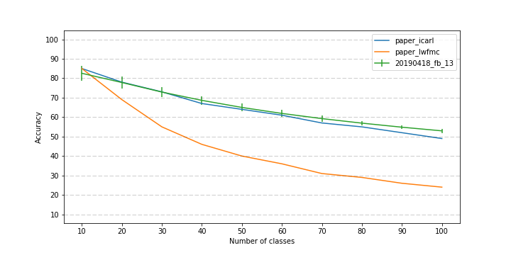

# Incremental Learning

*Also called lifelong learning, or continual learning.*

This repository will store all my implementations of Incremental Learning's papers.

## Structures

Every model must inherit `inclearn.models.base.IncrementalLearner`.

## Papers implemented:

:white_check_mark: --> Paper implemented & reached expected results.\
:construction: --> Runnable but not yet reached expected results.\
:x: --> Not yet implemented or barely working.\

[1]: :construction: iCaRL\
[2]: :construction: LwF\
[3]: :construction: End-to-End Incremental Learning\

## iCaRL

My experiments are in green, with their means & standard deviations plotted.
They were runned 40 times, with seed going from 1 to 40, each producing a
different classes ordering.

The metric used is the `average incremental accuracy`:

> The result of the evaluation are curves of the classification accuracies after
> each batch of classes. If a single number is preferable, we report the average of
> these accuracies, called average incremental accuracy.

~If I understood well, the accuracy at task i (computed on all seen tasks) is averaged~
~with all previous accuracy. A bit weird, but doing so get me a curve very similar~
~to what the papier displayed.~

EDIT: I've plot on the curve the "average incremental accuracy" but I'm not sure
if the authors plot this metrics or simply used it in the tables results. Thus I'm
not sure of my results validity.

---
