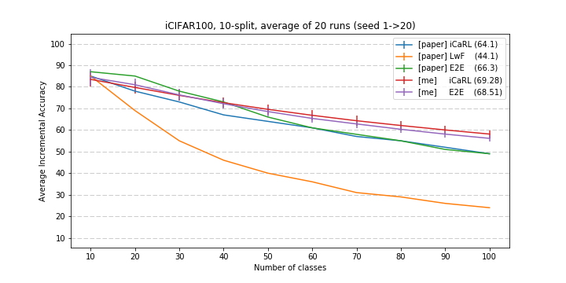

# Incremental Learning

*Also called lifelong learning, or continual learning.*

This repository will store all my implementations of Incremental Learning's papers.

## Structures

Every model must inherit `inclearn.models.base.IncrementalLearner`.

## Papers implemented:

:white_check_mark: --> Paper implemented & reached expected (or more) results.\
:construction: --> Runnable but not yet reached expected results.\
:x: --> Not yet implemented or barely working.

:white_check_mark: iCaRL\
:construction: Learning without Forgetting (LwF)\
:white_check_mark: End-to-End Incremental Learning (E2E)
:x: Overcoming catastrophic forgetting (EWC)

## Results

Every experiments have been runned at least 20 times, each with a different class
ordering. The class ordering is defined by random using a different seed. I'm
using the seed from 1 to 20.

````
python3 inclearn --model <model> --seed-range 1 20 --name <exp_name> <other options>
```

The metric used is what iCaRL defined the `average incremental accuracy`. It's
what is plotted on every graph. In addition the in-parenthesis metric is the
average of those average incremental accuracy. You can see in the notebook
[here](results.ipynb) how it is done.

I'll always precise whether the results are from a paper `[paper]` or myself `[me]`.


### iCIFAR100, 10-split



### iCIFAR100, 2-split

TODO


## TODO

- [ ] Add subparser per paper
