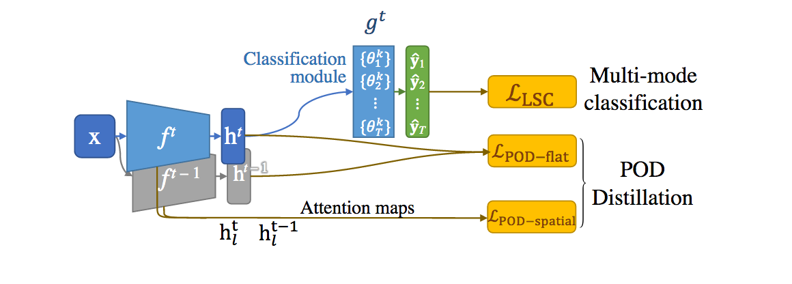
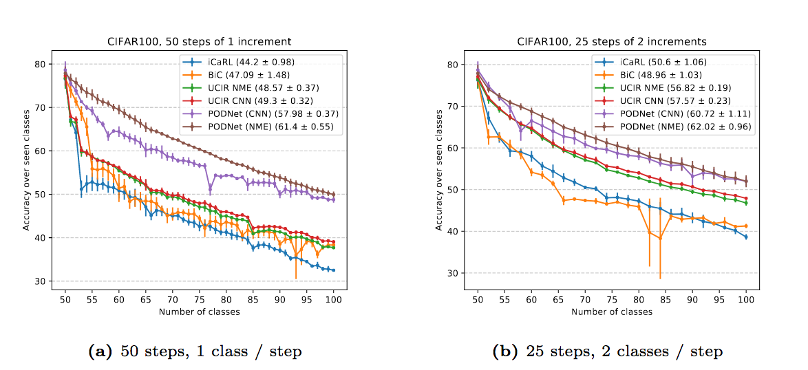
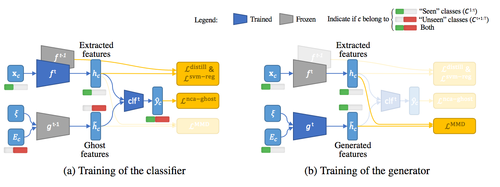

# Incremental Learners for Continual Learning

Repository storing some my public works done during my PhD thesis (2019-).

You will find in there both known implementation (iCaRL, etc.) but also all my papers.
You can find the list of the latter on my [Google Scholar](https://scholar.google.com/citations?user=snwgZBIAAAAJ&hl=en).

My work on continual segmentation can be found [here](https://github.com/arthurdouillard/CVPR2021_PLOP) and on continual data loaders [here](https://github.com/Continvvm/continuum).

## Structures

Every model must inherit `inclearn.models.base.IncrementalLearner`.

<div align="center">

# PODNet: Pooled Outputs Distillation for Small-Tasks Incremental Learning

[](https://arxiv.org/abs/2004.13513)

[](https://www.youtube.com/watch?v=SWFO1_lTcR8)

</div>





If you use this paper/code in your research, please consider citing us:

```
@inproceedings{douillard2020podnet,
    title={PODNet: Pooled Outputs Distillation for Small-Tasks Incremental Learning},
    author={Douillard, Arthur and Cord, Matthieu and Ollion, Charles and Robert, Thomas and Valle, Eduardo},
    booktitle={Proceedings of the IEEE European Conference on Computer Vision (ECCV)},
    year={2020}
}
```

To run experiments on CIFAR100 with three different class orders, with the challenging
setting of 50 steps:

```bash
python3 -minclearn --options options/podnet/podnet_cnn_cifar100.yaml options/data/cifar100_3orders.yaml \
    --initial-increment 50 --increment 1 --fixed-memory \
    --device <GPU_ID> --label podnet_cnn_cifar100_50steps \
    --data-path <PATH/TO/DATA>
```

Likewise, for ImageNet100:

```bash
python3 -minclearn --options options/podnet/podnet_cnn_imagenet100.yaml options/data/imagenet100_1order.yaml \
    --initial-increment 50 --increment 1 --fixed-memory \
    --device <GPU_ID> --label podnet_cnn_imagenet100_50steps \
    --data-path <PATH/TO/DATA>
```

And ImageNet1000:

Likewise, for ImageNet100:

```bash
python3 -minclearn --options options/podnet/podnet_cnn_imagenet100.yaml options/data/imagenet1000_1order.yaml \
    --initial-increment 500 --increment 50 --fixed-memory --memory-size 20000 \
    --device <GPU_ID> --label podnet_cnn_imagenet1000_10steps \
    --data-path <PATH/TO/DATA>
```

Furthermore several options files are available to reproduce the ablations showcased
in the paper. Please see the directory `./options/podnet/ablations/`.

<div align="center">

# Insight From the Future for Continual Learning

[](https://arxiv.org/abs/2006.13748)


</div>



If you use this paper/code in your research, please consider citing us:

```
@inproceedings{douillard2020ghost,
    title={Insight From the Future for Continual Learning},
    author={Arthur Douillard and Eduardo Valle and Charles Ollion and Thomas Robert and Matthieu Cord},
    booktitle={arXiv preprint library},
    year={2020}
}
```

The code is still very dirty, I'll clean it later. Forgive me.
